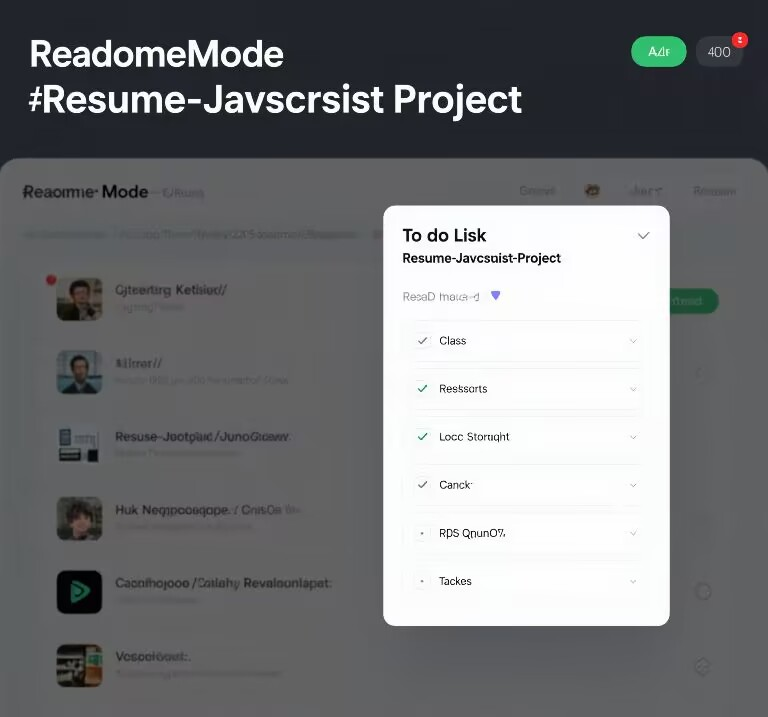

# Resume - Javascript Project

<!-- Project Description & Overview - Authored by 杨慧萍 -->
A lightweight and easy-to-use to-do list manager built with JavaScript and Vue.js. This application allows you to efficiently add, complete, and delete tasks, making it an ideal tool for personal time management. It also serves as a demonstration of your front-end development skills, particularly in JavaScript and Vue.js, for your resume.

## ✨ Features

<!-- Features Section - Authored by 杨慧萍 -->
- 📝 **Comprehensive Task Management:**
  - **Add Tasks:** Easily add new tasks with detailed descriptions through a user-friendly interface.
  - **Edit Tasks:** Modify existing tasks to keep your to-do list up-to-date.
  - **Delete Tasks:** Remove tasks that are no longer relevant.

- ✅ **Intuitive Task Completion Tracking:**
  - **Check off Completed Items:** Mark tasks as completed by simply checking the box next to each task.
  - **Real-time Updates:** The application dynamically updates the task list, clearly distinguishing between completed and pending tasks, providing a clear overview of your progress.

- 💾 **Persistent Local Storage:**
  - **Browser-Based Storage:** Utilizes the browser's LocalStorage to save your task data locally. This ensures your task list remains intact even after closing the browser or refreshing the page.

- 🎨 **Responsive Design:**
  - **Cross-Device Compatibility:** Features a responsive design that adapts seamlessly to various screen sizes, ensuring a consistent and optimal user experience across desktops, tablets, and mobile devices.

- 🛠️ **Technology Stack Showcase (For Resume):**
  - **JavaScript Proficiency:** Demonstrates your strong grasp of JavaScript for implementing interactive functionalities.
  - **Vue.js Framework:** Highlights your ability to build modern front-end interfaces using the Vue.js framework.
  - **Component-Based Development:** Showcases good development practices through the use of reusable components, enhancing code maintainability and reusability.

## 🚀 Getting Started

<!-- Getting Started Section - Authored by 杨慧萍 -->
To get started with this project, follow these steps:

### Clone the repository

```bash
git clone https://github.com/yang2205/Resume-Javascript.git
cd Resume-Javascript-Project

### Install dependencies

```bash
npm install
```

### Run the app

```bash
npm run dev
```

Visit `http://localhost:8080` in your browser to see the app in action.

## 📦 Project Structure
<!-- Features Section - Authored by 杨慧萍 -->
```
Resume-Javascript-Project/
├── images/                   # Project images
├── css/                      # Stylesheets
├── README.md                 # This file
├── .vscode/                  # Visual Studio Code settings
├── package.json              # Project metadata and dependencies
├── launch.json               # Debugging configuration
├── index.html                # Main HTML file
└── src/
    ├── components/           # Reusable Vue components
    ├── App.vue               # Main application component
    └── main.js               # Entry point for the app
```

## 📮 Primary function & Screenshot
<!-- Features Section - Authored by 杨慧萍 -->
1.Add Task
Users can add new tasks to the to-do list.



2.Check off completed items
Completed tasks can be checked off, and the app will update accordingly.


## License

<!-- License Section - Authored by 杨慧萍 -->
This project is licensed under the MIT License. For more details, please refer to the [LICENSE file][LICENSE][def2].
[def2]: https://choosealicense.com/licenses/mit/

## Acknowledgments
1.Special thanks to anyone who contributed to the project or provided inspiration.
2.Thanks to the Vue.js community for their invaluable resources and support.

