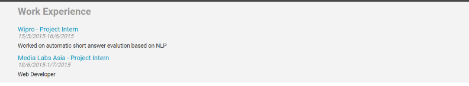
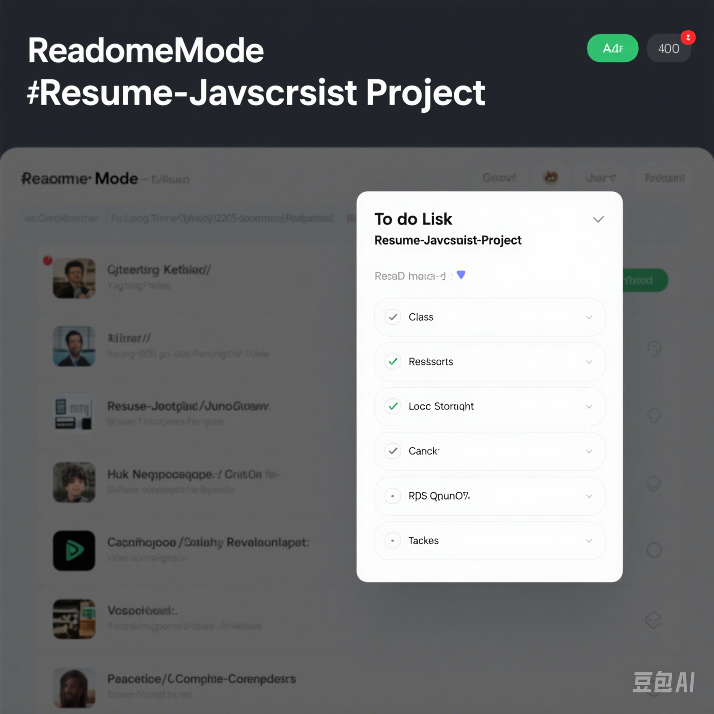
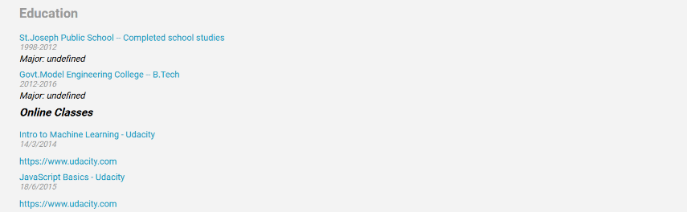

# 简历 - JavaScript 项目
 
<!-- 项目描述与概述 - 作者：杨银练 -->
本项目是一个在线简历网站，用于展示个人信息、工作经历、项目经历、教育背景和技能。该网站使用 HTML、CSS、JavaScript 和 Vue.js 构建，采用响应式设计，确保在各种设备上都能良好显示。
 
## ✨ 功能特点
 
<!-- 功能特点部分 - 作者：杨银练 -->
- 📝 **个人信息展示**：
  - **描述**：展示个人基本信息，包括姓名、联系方式（邮箱、电话）、GitHub、Twitter 等。
  - **实现方式**：使用 HTML 和 CSS 进行布局，信息通过 HTML 内容直接展示。
  - **截图**：
 
- ✅ **工作经历**：
  - **描述**：列出工作经历，包括公司名称、职位和任职时间。
  - **实现方式**：使用 HTML 列表元素展示工作经历，包含详细的时间段和职位描述。
  - **截图**：
 
- 💾 **项目经历**：
  - **描述**：列出参与的项目及其描述。每个项目包括项目名称、时间周期和详细描述。
  - **实现方式**：使用 HTML 和 CSS 进行布局，每个项目作为列表项展示，包含项目名称、时间周期和详细描述。
  - **截图**：
 
- 🎨 **教育背景**：
  - **描述**：列出教育经历，包括学校名称、时间周期和专业。
  - **实现方式**：使用 HTML 列表元素展示教育经历，每个经历包括学校名称、时间周期和专业。
  - **截图**：
 
- 🛠️ **技能展示**：
  - **描述**：列出所掌握的技能。
  - **实现方式**：使用 HTML 和 CSS 进行布局，技能以项目符号列表形式展示。
  - **截图**：
 
## 🚀 开始使用
 
<!-- 开始使用部分 - 作者：杨银练 -->
要开始使用本项目，请按照以下步骤操作：
 
### 克隆仓库
 
```bash
git clone https://github.com/yang2205/Resume-Javascript.git
cd Resume-Javascript-Project
安装依赖
bash
npm install
运行应用
bash
npm run dev
在浏览器中访问 http://localhost:8080 查看应用效果。

📦 项目结构
Resume-Javascript-Project/
├── images/                   # 项目图片
├── css/                      # 样式表
├── README.md                 # 英文版 README 文件
├── .vscode/                  # Visual Studio Code 设置
├── package.json              # 项目元数据和依赖项
├── launch.json               # 调试配置
├── index.html                # 主 HTML 文件
└── src/
    ├── components/           # 可复用的 Vue 组件
    ├── App.vue               # 主应用组件
    └── main.js               # 应用入口点
📮 技术栈分析
📝 Vue.js：
用途：构建响应式组件系统和前端页面状态管理。
在简历项目中的作用：如果简历项目需要“动态和交互性”（例如，通过点击切换内容或展开/折叠模块），Vue 可以简化 UI 构建和数据绑定。
📝 JavaScript：
用途：实现页面的交互功能。
在简历项目中的作用：控制按钮、点击事件、滚动效果或动态数据渲染（例如，通过 JavaScript 加载工作经历或项目列表）。
📝 HTML5：
用途：定义网页的结构和语义。
在简历项目中的作用：构建基本的页面结构，如标题、段落、图片、超链接、列表等。
📝 CSS3：
用途：用于页面样式和响应式布局（如媒体查询）。
在简历项目中的作用：控制颜色、字体、间距和布局，使简历页面看起来专业且美观。实现不同设备的响应式支持。
📝 CSS（SASS 扩展语法）：
用途：使 CSS 更有结构，支持变量、嵌套和混合等高级特性。
在简历项目中的作用：更高效地组织样式，例如统一颜色变量和组件样式复用。
!!总结!!:
本项目是一个结构清晰、功能完整的在线简历页面模板，适合用于展示开发者的专业信息，尤其适合前端初学者练习或制作个人作品集。

许可证
本项目采用 MIT 许可证。有关详细信息，请参阅 [LICENSE 文件][LICENSE][def2]。
[def2]: https://choosealicense.com/licenses/mit/